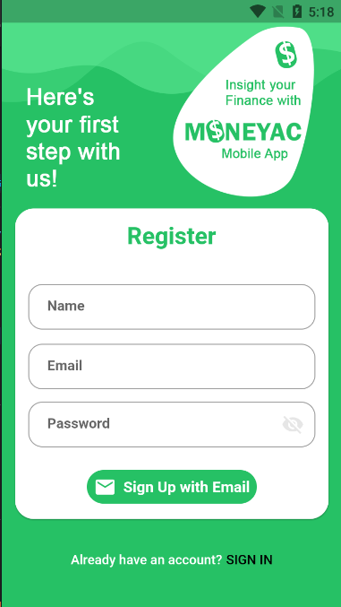
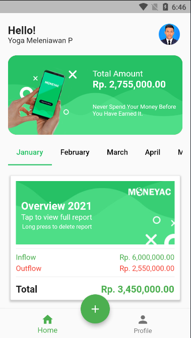
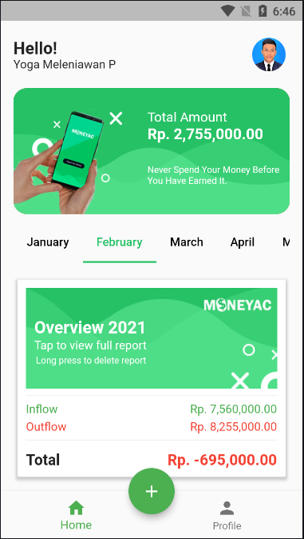
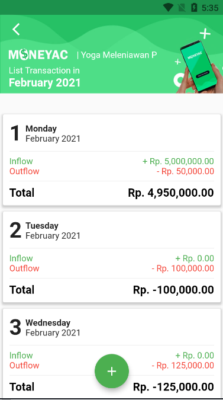
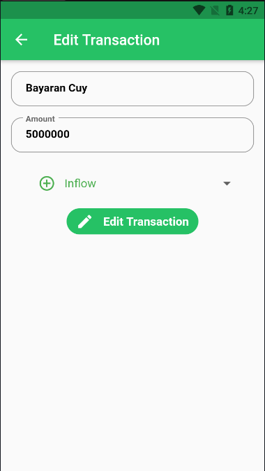

# mobileapp_moneyac

Moneyac App Mobile was created by Flutter and Firebase API

## Login Register

## Home Screen

## Transaction Month

## Transaction Day

## Add Transaction

## Edit Transaction

## Delete Transaction

## Profile Page

## Error Handling

## Getting Started

This project is a starting point for a Flutter application.

A few resources to get you started if this is your first Flutter project:

- [Lab: Write your first Flutter app](https://flutter.dev/docs/get-started/codelab)
- [Cookbook: Useful Flutter samples](https://flutter.dev/docs/cookbook)

For help getting started with Flutter, view our
[online documentation](https://flutter.dev/docs), which offers tutorials,
samples, guidance on mobile development, and a full API reference.
